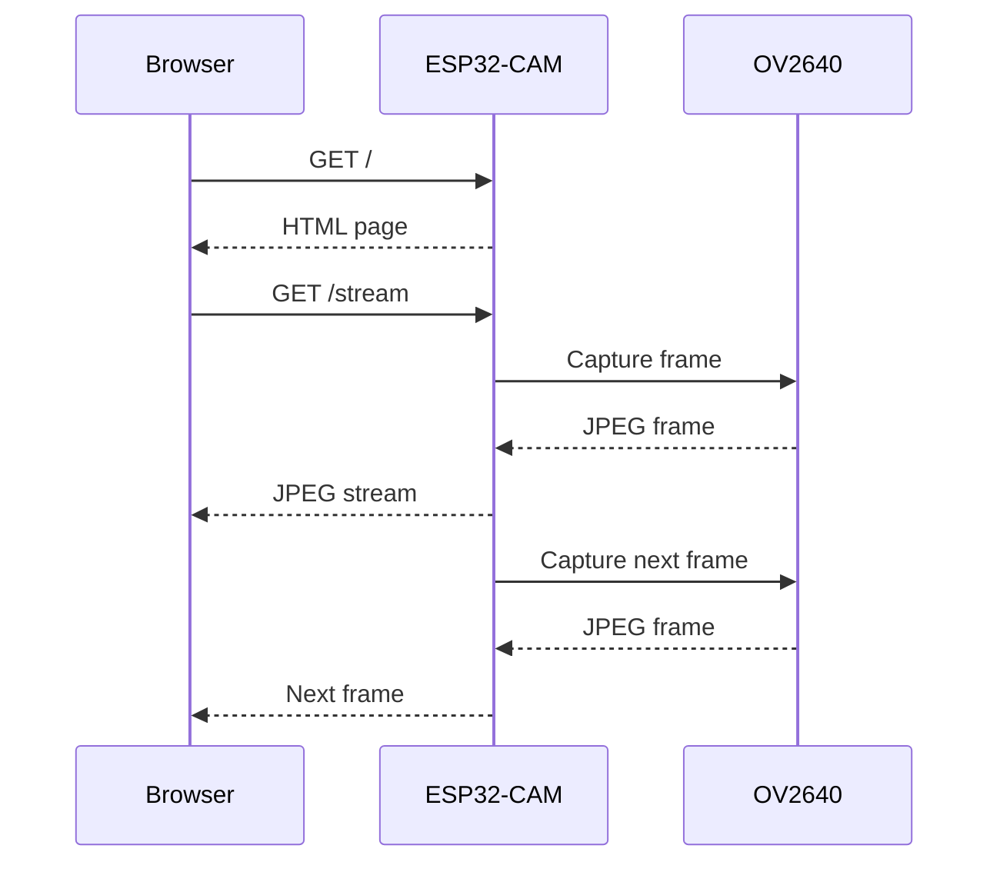

# 📷 ESP32-CAM Complete Guide

[](https://www.espressif.com/)
[](https://www.arduino.cc/)
[](https://isocpp.org/)
[](#-documentation)
[](LICENSE)

A clean, beginner-friendly repository for learning the **ESP32-CAM** from zero to practical camera and IoT projects.

> **Target board:** The examples in this repository are written primarily for the common **AI-Thinker ESP32-CAM with OV2640**. Other ESP32-CAM variants may use different pins or camera modules.

---

## 📚 What is ESP32-CAM?

ESP32-CAM is a compact ESP32-based development board that combines:

- 🧠 ESP32 microcontroller
- 📷 Camera interface, commonly OV2640
- 📶 Wi-Fi
- 🔵 Bluetooth capability provided by supported ESP32 variants
- 💾 microSD card interface on common boards
- 🧠 PSRAM on many variants
- 🔌 GPIO for external electronics
- 💡 On-board flash LED on common AI-Thinker boards

The basic idea is:

```text
             ┌─────────────────┐
             │    OV2640       │
             │     Camera      │
             └────────┬────────┘
                      │
                      ▼
             ┌─────────────────┐
             │      ESP32      │
             │  Main Controller│
             └───────┬─┬─┬─────┘
                     │ │ │
          ┌──────────┘ │ └──────────┐
          ▼            ▼            ▼
        Wi-Fi        microSD       GPIO
          │            │            │
          ▼            ▼            ▼
      Phone/PC       Photos       Sensors
```

---

## ✨ Repository Goals

This project is designed to make ESP32-CAM easy to learn:

- Understand the hardware
- Learn the important pins
- Set up Arduino IDE
- Upload your first program
- Test serial communication
- Initialize the camera
- Connect to Wi-Fi
- Build a browser-based camera
- Work with microSD storage
- Add sensors and LEDs
- Progress toward computer vision and IoT

---

## 🗂️ Repository Structure

```text
ESP32-CAM-Guide/
│
├── README.md
├── LICENSE
├── .gitignore
│
├── docs/
│   ├── hardware.md
│   ├── software.md
│   └── GPIO.md
│
├── examples/
│   ├── 01_serial_test/
│   │   └── 01_serial_test.ino
│   ├── 02_flash_led_test/
│   │   └── 02_flash_led_test.ino
│   └── 03_camera_web_server/
│       └── 03_camera_web_server.ino
│
└── images/
    └── README.md
```

---

## 📖 Documentation

| Document | Purpose |
|---|---|
| [`docs/hardware.md`](docs/hardware.md) | Board components and hardware |
| [`docs/software.md`](docs/software.md) | Arduino IDE, libraries, uploading |
| [`docs/GPIO.md`](docs/GPIO.md) | GPIO, camera, SD and boot pins |
| [`examples/`](examples/) | Beginner example sketches |

---

## 🧰 Hardware You Need

For the basic examples:

- ESP32-CAM board
- OV2640 camera, if not already installed
- USB-to-UART programmer
- USB cable
- Computer
- Stable power source
- Wi-Fi network for network examples

Optional:

- microSD card
- Jumper wires
- Sensors
- LEDs
- Push buttons

---

## 💻 Software

Recommended beginner setup:

1. Install Arduino IDE.
2. Add ESP32 board support.
3. Select the board matching your hardware.
4. Select the correct serial port.
5. Upload the example.
6. Open Serial Monitor at `115200` baud.

See [`docs/software.md`](docs/software.md) for setup details.

---

## 🚀 Quick Start

### 1. Clone the repository

```bash
git clone https://github.com/YOUR-USERNAME/ESP32-CAM-Guide.git
cd ESP32-CAM-Guide
```

### 2. Start with the serial test

Open:

```text
examples/01_serial_test/01_serial_test.ino
```

Upload it and open Serial Monitor at:

```text
115200 baud
```

You should see:

```text
==========================
   ESP32-CAM TEST
==========================
ESP32-CAM started!
ESP32-CAM is running...
```

### 3. Test the flash LED

Open:

```text
examples/02_flash_led_test/02_flash_led_test.ino
```

The example uses the common AI-Thinker flash LED pin. Verify your exact board before using it.

### 4. Try the browser camera

Open:

```text
examples/03_camera_web_server/03_camera_web_server.ino
```

Set your Wi-Fi credentials:

```cpp
const char* ssid = "YOUR_WIFI_NAME";
const char* password = "YOUR_WIFI_PASSWORD";
```

Upload the program, then open Serial Monitor.

The ESP32-CAM will print an address similar to:

```text
http://192.168.1.50
```

Open that address in a browser on the same local network.

---

## 🌐 Camera Data Flow


---

## 🔌 Programming Connection

A common USB-UART programming setup looks like:

```text
Computer
   │
 USB
   │
   ▼
USB-UART Adapter
   │
   ├──── TX ─────► ESP32-CAM RX
   ├──── RX ◄───── ESP32-CAM TX
   └──── GND ───── ESP32-CAM GND
```

> Power wiring depends on the exact ESP32-CAM and USB-UART adapter. Use a stable, appropriate supply and verify the board documentation before connecting power.

For boards that use GPIO0 to enter download mode:

```text
GPIO0 → GND
   ↓
Reset / power cycle
   ↓
Upload firmware
   ↓
Remove GPIO0 from GND
   ↓
Reset
   ↓
Run program
```

---

## 🧠 How a Browser Camera Works



---

## 🧩 Beginner Learning Path

```text
1. Serial Test
      ↓
2. GPIO / LED
      ↓
3. Camera Initialization
      ↓
4. Capture Image
      ↓
5. microSD Storage
      ↓
6. Wi-Fi
      ↓
7. Web Server
      ↓
8. Live Camera Stream
      ↓
9. Sensors
      ↓
10. IoT
      ↓
11. Computer Vision / AI
```

---

## 🔐 Security & Privacy

If you build a network-connected camera:

- Use it only where you have permission.
- Do not expose an unsecured camera directly to the public internet.
- Do not commit Wi-Fi passwords or API keys.
- Keep private photos outside the repository.
- Use authentication for remote-access systems.
- Consider the privacy of people who may appear in images.

### Keep secrets out of Git

Do not commit:

```cpp
const char* ssid = "my-real-wifi";
const char* password = "my-real-password";
```

For public repositories, use a local secrets file and add it to `.gitignore`.

---

## ⚠️ Important Hardware Notes

ESP32-CAM boards are not all identical.

Before connecting hardware, verify:

- Exact board model
- Camera model
- GPIO assignments
- Flash LED pin
- microSD pin usage
- Supply voltage requirements
- USB-UART voltage configuration

Some GPIOs are shared with the camera, SD card, boot process, or other board functions.

---

## 🛠️ Troubleshooting

### Upload fails

Check:

- Correct board selected
- Correct serial port
- TX/RX are connected correctly
- Common GND
- Correct download/boot mode
- Stable power
- GPIO0 configuration if required

### Camera initialization fails

Check:

- Camera ribbon cable
- Correct camera model
- Correct board pin configuration
- Camera connector
- PSRAM configuration
- Power stability

### Board repeatedly resets

Possible causes:

- Unstable power
- Incorrect wiring
- Software crash
- Excessive peripheral load
- Incorrect GPIO usage

### Browser cannot connect

Check:

- ESP32 connected to Wi-Fi
- Browser device is on the same network
- IP address printed by Serial Monitor
- Local firewall/network isolation
- Stable ESP32 power

---

## 📌 Recommended Next Projects

### Beginner

- [ ] Serial monitor test
- [ ] Flash LED test
- [ ] Camera initialization
- [ ] Take a photo
- [ ] Save a photo to microSD

### Intermediate

- [ ] Wi-Fi camera
- [ ] Web camera
- [ ] Button-controlled photo capture
- [ ] Motion-triggered camera
- [ ] Sensor + camera

### Advanced

- [ ] Camera dashboard
- [ ] Image classification
- [ ] Lightweight object detection
- [ ] External AI server
- [ ] IoT camera system

---

## 🤝 Contributing

Contributions are welcome.

A simple workflow:

```bash
git checkout -b feature/my-improvement
```

Make your changes, test them, then:

```bash
git add .
git commit -m "Add my improvement"
git push origin feature/my-improvement
```

Then open a Pull Request on GitHub.


## ⭐ Final Idea

ESP32-CAM becomes much easier when you learn it one layer at a time:

> **Hardware → GPIO → Camera → Wi-Fi → Web → Sensors → IoT → AI**

Have fun building! 🚀📷
